# 基于 vue3.x适配手机、平板、pc 的后台开源模板 #

2022-02-16 00:10·[GitHub精选](https://www.toutiao.com/c/user/token/MS4wLjABAAAAR8kdrQtU5CzrM3VhvfIpo8Y63Heul5AiaexL-yPVhYRK7qwQet2M3jVOVVvUPuc0/?source=tuwen_detail)

《开源精选》是我们分享Github、Gitee等开源社区中优质项目的栏目，包括技术、学习、实用与各种有趣的内容。本期推荐的是基于vue3.x的后台开源模板——vue-next-admin。

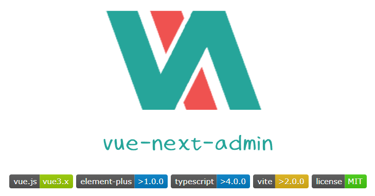

vue-next-admin是一个基于 vue3.x + CompositionAPI + typescript + vite + element plus + vue-router-next + next.vuex，适配手机、平板、pc 的后台开源免费模板，希望减少工作量，帮助大家实现快速开发。


## 环境支持 ##

由于 Vue3 不再支持 IE11，故而 ElementPlus 也不支持 IE11 及之前版本。

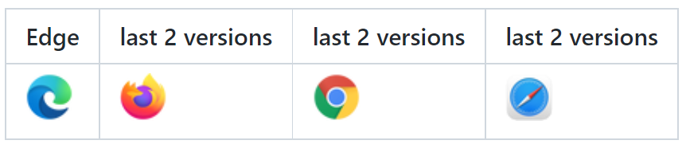

## 使用说明 ##

**代码仓库**

vue3.x 版本：
https://gitee.com/lyt-top/vue-next-admin

vue2.x 版本：
https://gitee.com/lyt-top/vue-next-admin/tree/vue-prev-admin

**安装 cnpm、yarn**

复制代码(桌面 cmd 运行)

	npm install -g cnpm --registry=https://registry.npm.taobao.org


或者

	npm install -g yarn

**运行项目**

建议使用 cnpm，因为 yarn 有时会报错。

```
# 克隆项目
git clone https://gitee.com/lyt-top/vue-next-admin.git

# 进入项目
cd vue-next-admin

# 安装依赖
cnpm install

# 运行项目
cnpm run dev

# 打包发布
cnpm run build
```

## 界面预览 ##

- vue3.x 版本预览（vue-next-admin）：https://lyt-top.gitee.io/vue-next-admin-preview/#/login
- vue2.x 版本预览（vue-prev-admin）： https://lyt-top.gitee.io/vue-prev-admin-preview/#/login

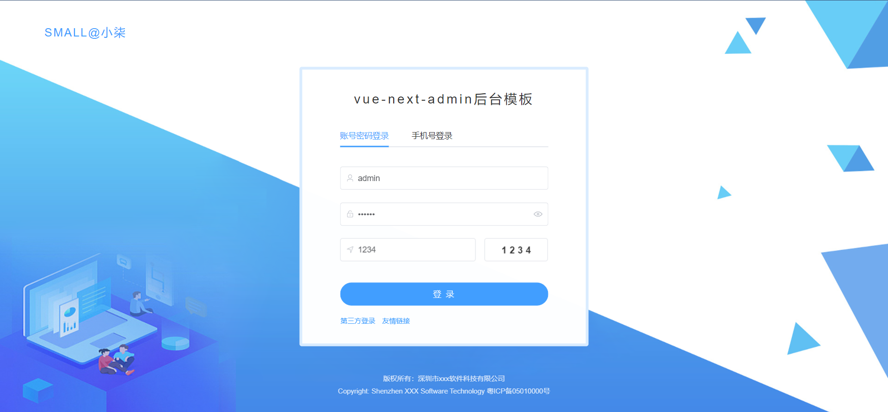

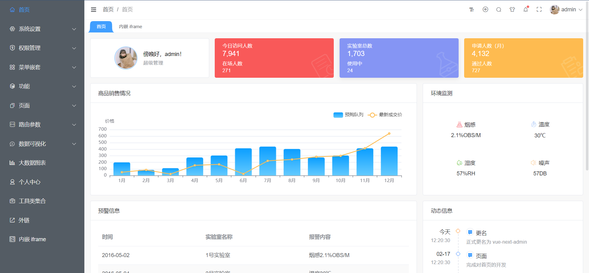

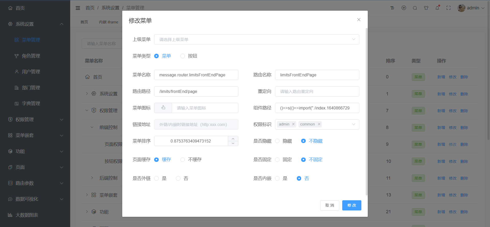

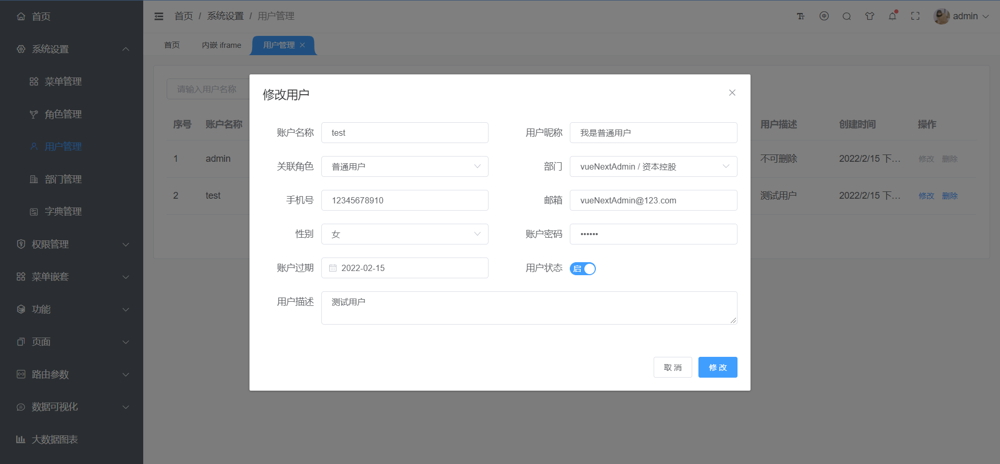

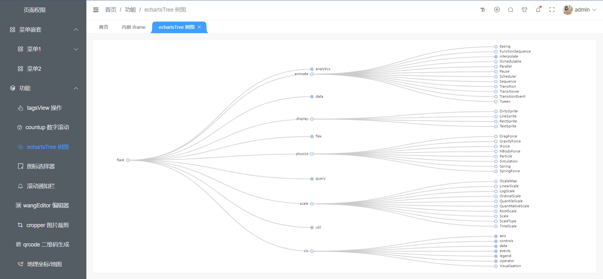

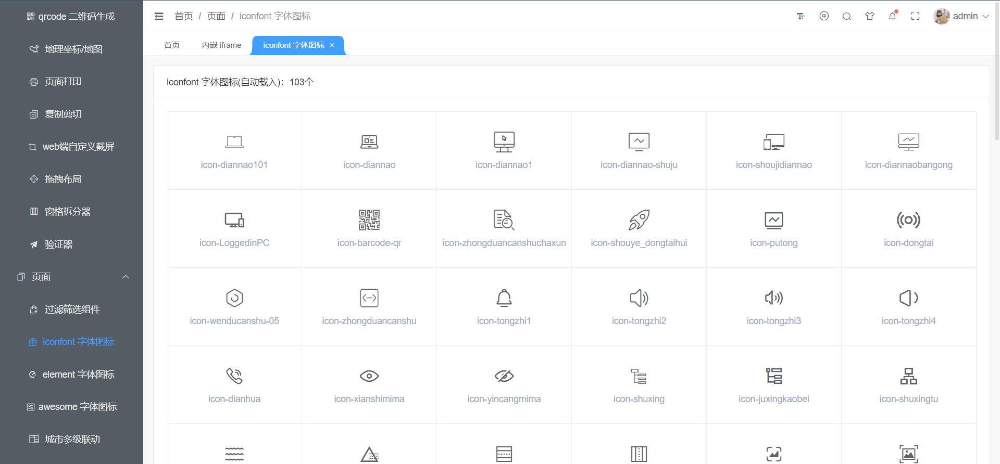

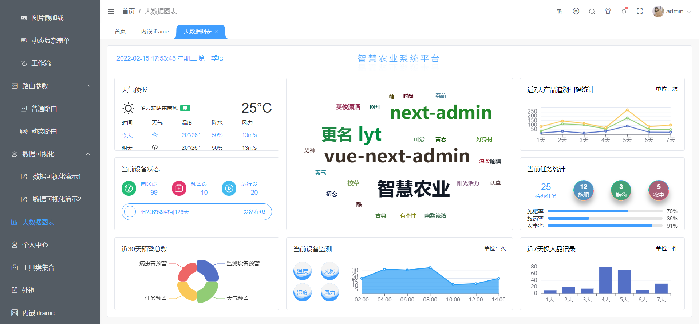

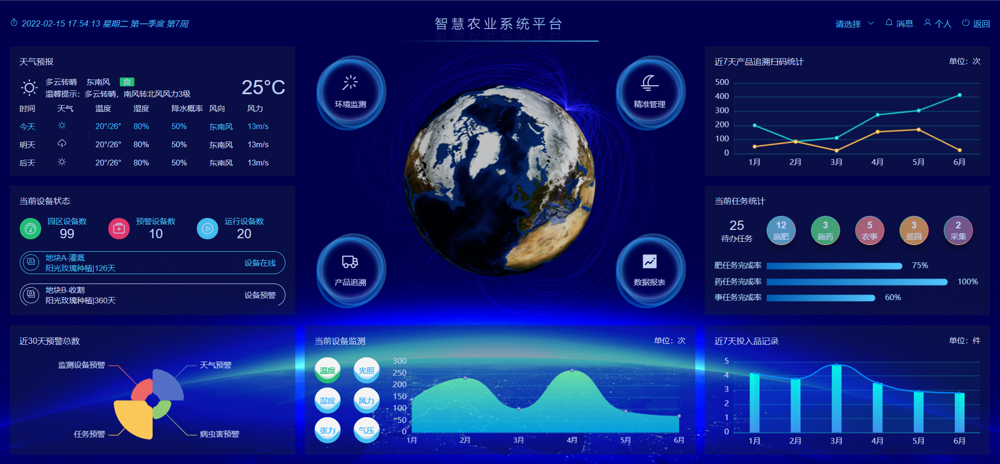

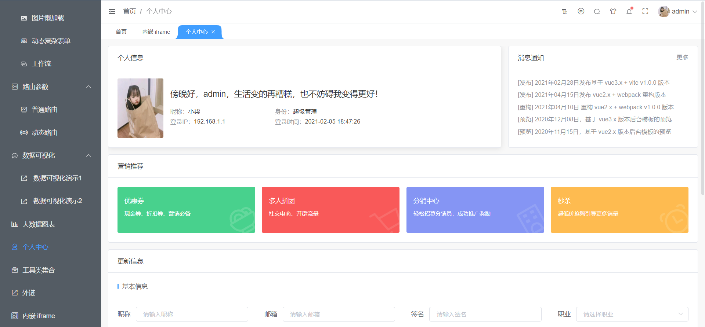

此项目使用MIT开源协议，更多功能大家可自行前往阅读。

开源地址：`https://gitee.com/lyt-top/vue-next-admin`