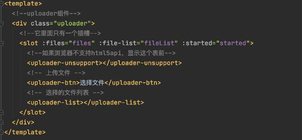

# 大文件上传, 断点续传, 秒传, beego,vue #

大文件上传

## 0, 项目源码地址 ##

源码地址 : https://github.com/zhuchangwu/large-file-upload

它是个 demo, 仅供参考

前端基于 vue-simple-uploader (感谢这个大佬)实现:

vue-simple-uploader 底层封装了 uploader.JS :

## 1, 如何唯一标识一个文件? ##

文件的信息后端会存储在 MySQL 数据库表中.

在上传之前, 前端通过 spark-md5.JS 计算文件的 md5 值以此去唯一的标示一个文件.

spark-md5.JS 地址: https://github.com/satazor/js-spark-md5

README.md 中有 spark-md5.JS 的使用 demo, 可以去看看.

## 2, 断点续传是如何实现的? ##

断点续传可以实现这样的功能, 比如用户上传 200M 的文件, 当用户上传完 199M 时, 断网了, 有了断点续传的功能, 我们允许 RD 再次上传时, 能从第 199M 的位置重新上传.

实现原理:

实现断点续传的前提是, 大文件切片上传. 然后前端得问后端哪些 chunk 曾经上传过, 让前端跳过这些上传过的 chunk 就好了.

前端的上传器 (uploader.JS) 在上传时会先发送一个 GET 请求, 这个请求不会携带任何 chunk 数据, 作用就是向后端询问哪些 chunk 曾经上传过. 后端会将这些数据保存在 MySQL 数据库表中. 比如按这种格式: 1:2:3:5 表示, 曾经上传过的分片有 1,2,3,5. 第四片没有被上传, 前端会跳过 1,2,3,5. 仅仅会将第四个 chunk 发送给后端.

## 3, 秒传是如何实现的? ##

秒传实现的功能是: 当 RD 重复上传一份相同的文件时, 除了第一次上传会正常发送上传请求后, 其他的上传都会跳过真正的上传, 直接显示秒成功.

实现方式:

后端存储着当前文件的相关信息. 为了实现秒传, 我们需要搞一个字段 (isUploaded) 表示当前 md5 对应的文件是否曾经上传过. 后端在处理 前端的上传器 (uploader.JS) 发送的第一个 GET 请求时, 会将这个字段发送给前端, 比如 isUploaded = true. 前端看到这个信息后, 直接跳过上传, 显示上传成功.

## 4, 上传暂停是如何实现的? ##

上传的暂停: 并不是去暂停一个已经发送出去的正在进行数据传输的 http 请求～

而是暂停发送起发送下一个 http 请求.

就我们的项目而言, 因为我们的文件本来就是先切片, 对于我们来说, 暂停文件的上传, 本质上就是暂停发送下一个 chunk.

## 5, 前端上传并发数是多少? ##

前端的 uploader.JS 中默认会三条线程启动并发上传, 前端会在同一时刻并发 发送 3 个 chunk, 后端就会相应的为每个请求开启三个协程处理上传的过来的 chunk.

在我们的项目中, 会将前端并发数调整成了 1. 原因如下:

因为考虑到了断点续传的实现, 后端需要记录下曾经上传过哪些切片.(这个记录在 MySQL 的数据库表中, 以 "1:2:3:4:5" )这种格式记录.

Mysql5.7 默认的存储引擎是 innoDB, 默认的隔离级别是 RR. 如果我们将前端的并发数调大, 就会出现下面的异常情况:

goroutine1 获取开启事物, 读取当前上传到记录是 1:2 (未提交事物)

goroutine1 在现有的记录上加上自己处理的分片 3, 并和现有的 1:2 拼接在一起成 1:2:3 (未提交事物)

goroutine2 获取开启事物,(因为 RR, 所以它读不到 1:2:3)读取当前上传到记录是 1:2 (未提交事物)

goroutine1 提交事物, 将 1:2:3 写回到 MySQL

goroutine2 在现有的记录上加上自己处理的分片 4, 并和现有的 1:2 拼接在一起成 1:2:4 (提交事物)

可以看到, 如果前端并发上传, 后端就会出现分片丢失的问题. 故前端将并发数置为 1.

## 6, 单个 chunk 上传失败怎么办? ##

前端会重传 chunk?

由于网络问题, 或者时后端处理 chunk 时出现的其他未知的错误, 会导致 chunk 上传失败.

uploaded.JS 中有如下的配置项, 每次 uploader.JS 在上传每一个切片实际上都是在发送一次 post 请求, 后端根据这个 post 请求是会给前端一个状态吗. uploader.JS 就是根据这个状态码去判断是失败了还是成功了, 如果失败了就会重新发送这个上传的请求.

那 uploader.JS 是如何知道有哪些状态吗是它应该重传 chunk 的标记呢? 看看下面 uploader.JS 需要的 options 就明白了, 其中的 permantErrors 中配置的状态码标示: 当遇到这个状态码时整个上传直接失败～

successStatuses 中配置的状态码表示 chunk 是上传成功的～. 其他的状态吗 uploader.JS 就会任务 chunk 上传的有问题, 于是重新上传～

```
options: {
          target: 'http://localhost:8081/file/upload',
          maxChunkRetries: 3,
          permanentErrors:[502], // 永久性的上传失败～, 会认为整个文件都上传失败了
          successStatuses:[200], // 当前 chunk 上传成功后的状态吗
          ...
        }
```

## 7, 超过重传次数后, 怎么办? ##

比如我们设置出错后重传的次数为 3, 那么无论当前分片是第几片, 整个文件的上传状态被标记为 false, 这就意味着会终止所有的上传.

肯定不会出现这种情况: chunk1 重传 3 次后失败了, chunk2 还能再去上传, 这样的话数据肯定不一致了.

## 8, 如何控制上传多大的文件? ##

目前了解到 nginx 端的限制上单次上传不能超过 1M.

前端会对大文件进行切片突破 nginx 的限制.

```
options: {
          target: 'http://localhost:8081/file/upload',
          chunkSize: 512000, // 单次上传 512KB
        }
```

如果后续和 nginx 负责的同学达成一致, 可以把这个值进行调整. 前端可以后续将这个 chunk 的阈值加大.

## 9, 如何保证上传文件的百分百正确? ##

在上传文件前, 前端会计算出当前 RD 选择的这个文件的 md5 值.

当后端检测到所有的分片全部上传完毕, 这时会 merge 所有分片汇聚成单个文件. 计算这个文件的 md5 同 RD 在前端提供的文件的 md5 值比对. 比对结果一致说明 RD 正确的完成了上传. 结果不一致, 说明文件上传失败了～返回给前端任务失败, 提示 RD 重新上传.

## 10, 其他细节问题: ##

如何判断文件上传失败了, 给 RD 展示红色?

如何控制上传什么类型的文件?

如何控制不能上传空文件?

上面说过了, 当 uploader.JS 遇到了 permanentErrors 这种状态码时会认为文件上传失败了.

前端想在上传失败后, 将进度条转换成红色, 其实改一下 CSS 样式就好了, 问题就在于, 根据什么去修改? 在哪里去修改?

前端会将每一个 file 封装成一个组件: 如下图中的 files 就是 file 的集合



整个的 fileList 会将会被渲染成下面这样.


我们上传的文件被 vue-simple-uploader 的作者封装成一个 file.vue 组件, 这个对象中会有个配置参数, 比如它会长下面这样.

```
options: {
        target: 'http://localhost:8081/file/upload',
        statusText: {
          success: '上传成功',
          error: '上传出错, 请重试',
          typeError: '暂不支持上传您添加的文件格式',
          uploading: '上传中',
          emptyError:'不能上传空文件',
          paused: '请确认文件后点击上传',
          waiting: '等待中'
        }
      }
    },
```

我们将上面的配置添加给 Uploader.JS

	const uploader = new Uploader(this.options)

在 file 组件中有如下计算属性的, 分别是 status 和 statusText

```
computed: {
      // 计算出一个状态信息
      status () {
        const isUploading = this.isUploading // 是否正在上传
        const isComplete = this.isComplete // 是否已经上传完成
        const isError = this.error // 是否出错了
        const isTypeError = this.typeError // 是否出错了
        const paused = this.paused // 是否暂停了
        const isEmpty = this.emptyError // 是否暂停了
        // 哪个属性先不为空, 就返回哪个属性
        if (isComplete) {
          return 'success'
        } else if (isError) {
          return 'error'
        } else if (isUploading) {
          return 'uploading'
        } else if (isTypeError) {
          return 'typeError'
        } else if (isEmpty) {
          return 'emptyError'
        } else if (paused) {
          return 'paused'
        } else {
          return 'waiting'
        }
      },
      // 状态文本提示信息
      statusText () {
        // 获取到计算出的 status 属性(相当于是个 key, 具体的值在下面的 fileStatusText 中获取到)
        const status = this.status
        // 从 file 的 uploader 对象中获取到 fileStatusText, 也就是用自己定义的名字
        const fileStatusText = this.file.uploader.fileStatusText
        let txt = status
        if (typeof fileStatusText === 'function') {
          txt = fileStatusText(status, this.response)
        } else {
          txt = fileStatusText[status]
        }
        return txt || status
      },
    },
```

status 绑定在 html 上

	<div class="uploader-file" :status="status">

对应的 CSS 样式入下:

```
.uploader-file[status="error"] .uploader-file-progress {
    background: #ffe0e0;
  }
```

综上: 有了上面代码的编写, 我们可以直接像下面这样控制就好了

```
file.typeError = true // 表示文件的类型不符合我们的预期, 不允许 RD 上传
  file.error = true // 表示文件上传失败了
  file.emptyError = true // 表示文件为空, 不允许上传
```

## 11, 后端数据库表设计 ##

```
CREATE TABLE `file_upload_detail` (
  `id` bigint(20) NOT NULL AUTO_INCREMENT COMMENT '主键',
  `username` varchar(64) NOT NULL COMMENT '上传文件的用户账号',
  `file_name` varchar(64) NOT NULL COMMENT '上传文件名',
  `md5` varchar(255) NOT NULL COMMENT '上传文件的 MD5 值',
  `is_uploaded` int(11) DEFAULT '0' COMMENT '是否完整上传过 \n0: 否 \ n1: 是',
  `has_been_uploaded` varchar(1024) DEFAULT NULL COMMENT '曾经上传过的分片号',
  `url` varchar(255) DEFAULT NULL COMMENT 'bos 中的 url, 或者是本机的 url 地址',
  `create_time` timestamp NOT NULL DEFAULT CURRENT_TIMESTAMP ON UPDATE CURRENT_TIMESTAMP  COMMENT '本条记录创建时间',
  `update_time` timestamp NULL DEFAULT NULL  COMMENT '本条记录更新时间',
  `total_chunks` int(11) DEFAULT NULL COMMENT '文件的总分片数',
  PRIMARY KEY (`id`)
) ENGINE=InnoDB AUTO_INCREMENT=2 DEFAULT CHARSET=utf8
```

## 12, 关于什么时候 mergechunk ##

在本文中给出的 demo 中, merge 是后端处理完成所有的 chunk 后, 像前端返回 merge=1, 这个表示来实现的.

前端拿着这个字段去发送 / merge 请求去合并所有的 chunk.

值得注意的地方是: 这个请求是在 uploader.JS 认为所有的分片全部成功上传后, 在单个文件成功上传的回调中执行的. 我想了一下, 感觉这么搞其实不太友好, 万一 merge 的过程中失败了, 或者是某个 chunk 丢失了, chunk 中的数据缺失, 最终 merge 的产物的 md5 值其实并不等于原文件. 当这种情况发生的时候, 其实上传是失败的. 但是后端既然告诉 uploader.JS 可以合并了, 说明后端的 upload 函数认为任务是成功的. vue-simple-uploader 上传完最后一个 chunk 得到的状态码是 200, 它也会觉得任务是成功的, 于是在前端段展示绿色的上传成功给用户看～(然而上传是失败的), 这么看来, 整个过程其实控制的不太好～

我现在的实现: 直接干掉 merge 请求, 前端 1 条线程发送请求, 将 chunk 依次发送到后端. 后端检测到所有的 chunk 都上传过来后主动 merge,merge 完成后马上校验文件的 md5 值是否符合预期. 这个处理过程在上传最后一个 chunk 的请求中进行, 因此可以实现的控制前端上传成功还是失败的样式～

来源: https://www.cnblogs.com/ZhuChangwu/p/13181560.html