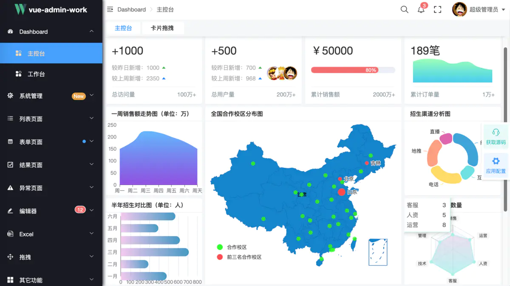
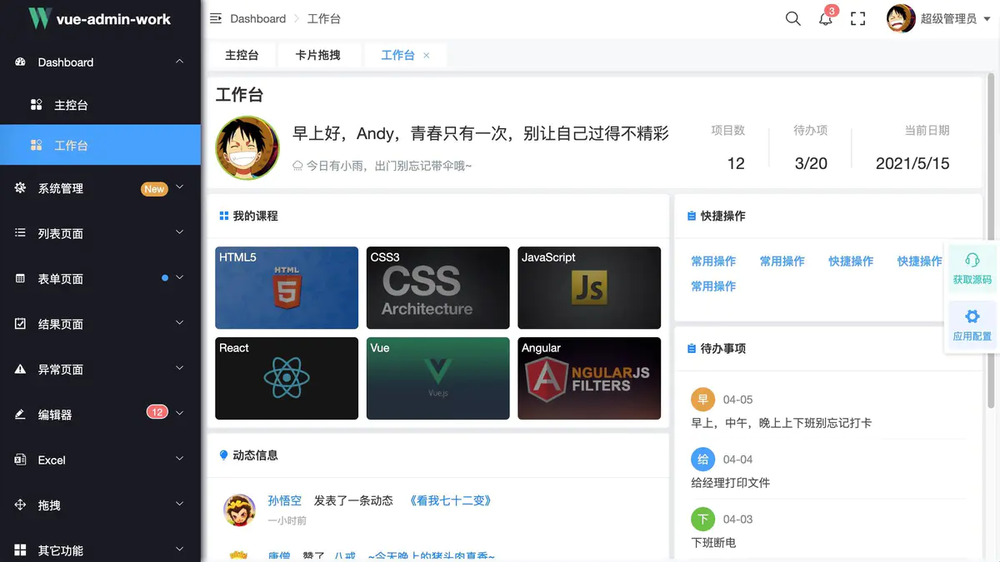
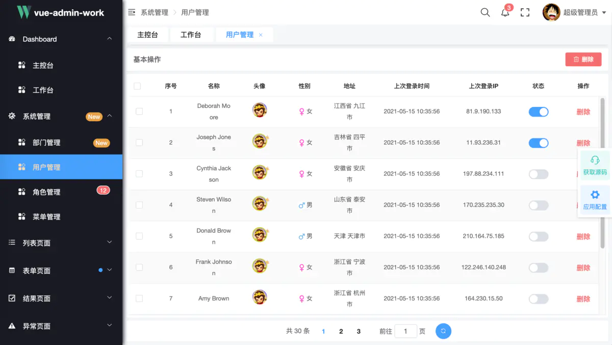
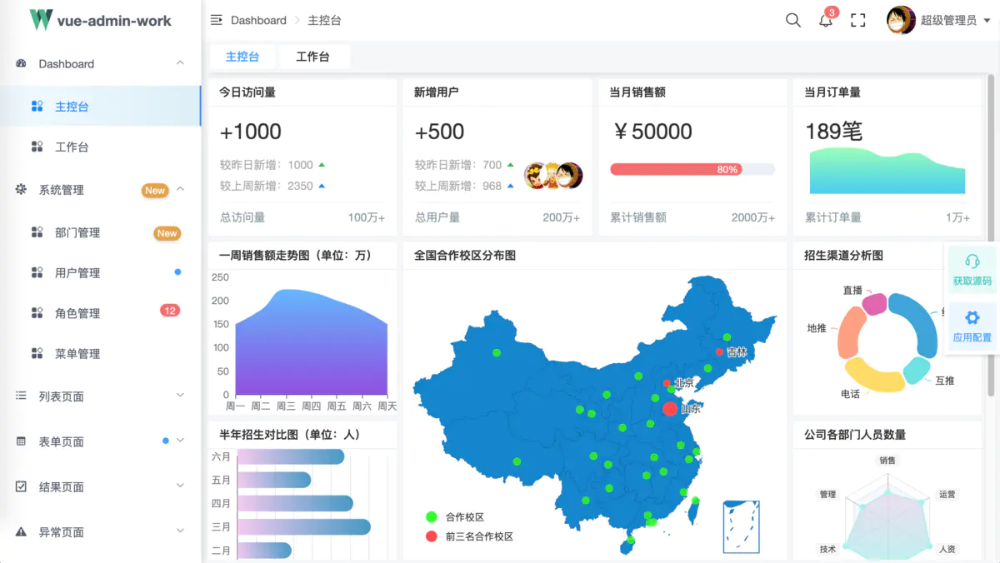
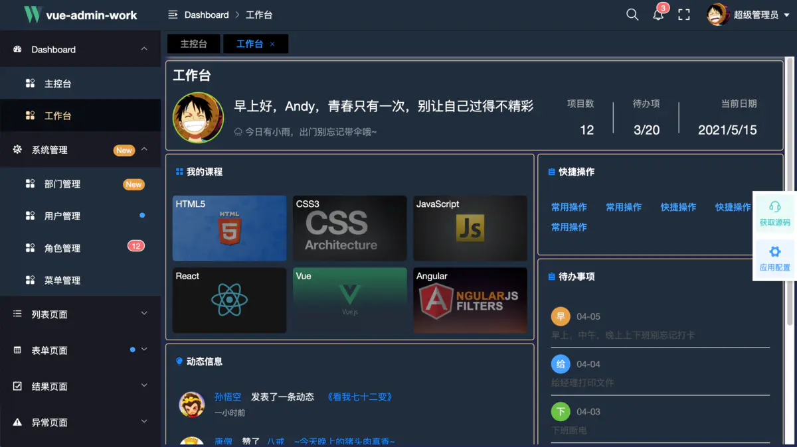
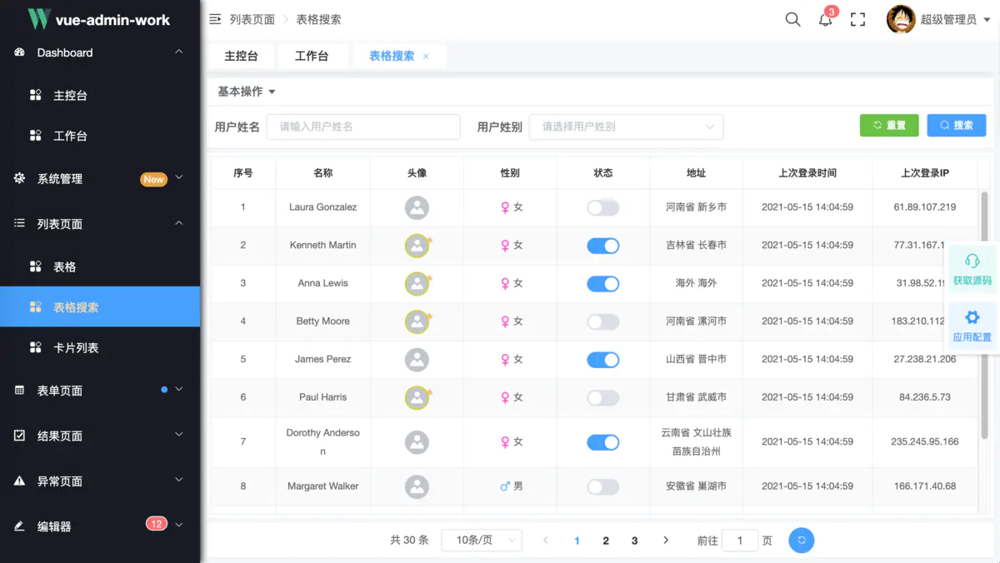
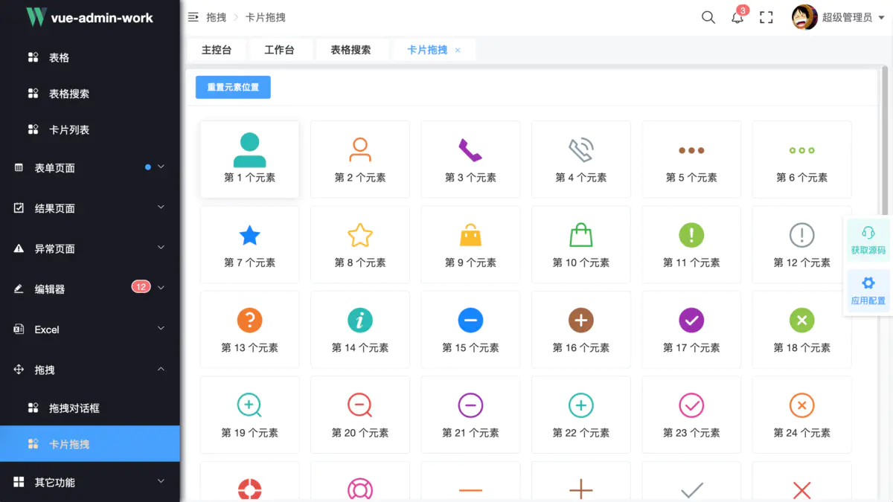
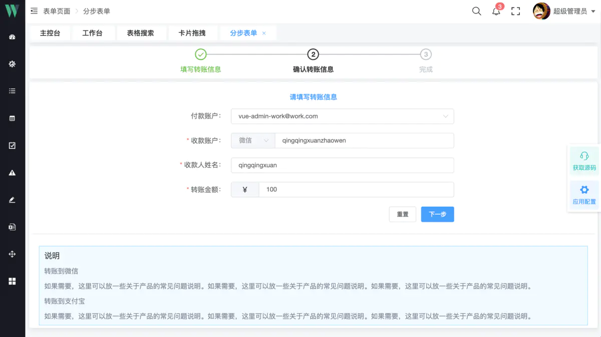

# 推荐一个后台前端解决方案 - vue-admin-work #

清清玄
0.106
2021.05.20 09:22:16
字数 548
阅读 336

## 前言 ##

Hello，广大的前端小伙伴们，大家好，好久没有和大家见面了，最近工作比较忙事情比较多，而且我趁着这段时间制作了一款框架 VUE-ADMIN-WORK ，是一个中后台解决方案。它基于 vue2.x 和 element-ui开发而来。它使用了最新的前端技术栈，动态路由，权限验证，提炼了典型的业务模型，提供了丰富的功能组件，它可以帮助你快速搭建企业级中后台产品原型。

本来只是想只为公司解决一些实际问题，不过看到有不少小伙伴私信有没有好的一款前端后台框架，或者说原来只是从事写静态页面，现在想学vue，但不知道该怎么学，相信本框架肯定能帮助你更好的提升自己的前端能力。

## 适合人群 ##

1、有一定的编程经验或者说之前对计算机软件了解过，如果是有前端编程经验那会更好的入手。

2、之前只写静态页面，在前后分离这样的大趋势下，想提升自己

3、之前从事后端，想学习一下前端

4、创业公司或者中小型公司想要快速搭建自己的前端后台管理系统

……

总之，你只要想学，这个框架总能帮助到你。

本框架会持续更新，不断修改问题，增加新的功能。关注公众号：知码前端 获取最新的前端知识以及能及时收到框架更新信息

## 项目地址： ##

请大家加QQ：353087890，或者关注公众号：知码前端 获取源码地址和演示地址

演示地址：http://qingqingxuan.gitee.io/vue-admin-work/
欢迎大家多多 star，万分感谢


## 功能 ##

```
- 登录、注销
- Dashboard
    - 主页
    - 工作台
- 系统管理
  - 部门管理
  - 用户管理
    - 角色管理
    - 菜单管理
- 列表页面
    - 表格操作
    - 表格搜索
    - 卡片列表
- 表单页面
    - 表单操作
    - 高级表单
    - 分步表单
    - 通知提示
- 结果页面
    - 成功页面
    - 失败页面
- 异常页面
    - 404
    - 403
    - 500
- 编辑器
    - 富文本
    - markdown
- 其它功能
    - 打印
    - 外链
    - 二维码
    - 未完待续……

- 全局功能
  - 多种动态换肤
  - 动态侧边栏（支持多级路由嵌套）
  - 动态面包屑
  - 快捷导航(标签页)
  - Svg Sprite 图标
  - 本地/后端 mock 数据
  - Screenfull全屏
    - 消息提醒
  - 自适应收缩侧边栏
    - 系统配置
```


project-image-1.png


project-image-2.jpg


project-image-3.png


project-image-4.png


project-image-5.png


project-image-6.png


project-image-7.png


project-image-8.png

更的页面需要你去下载源码自己运行查看，相信肯定会有所收获